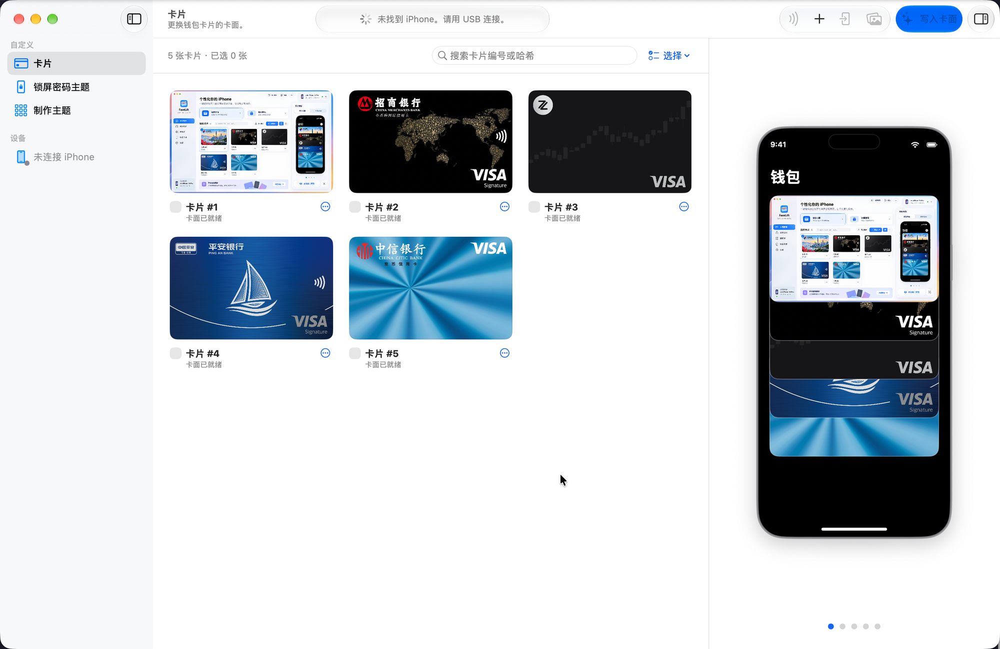
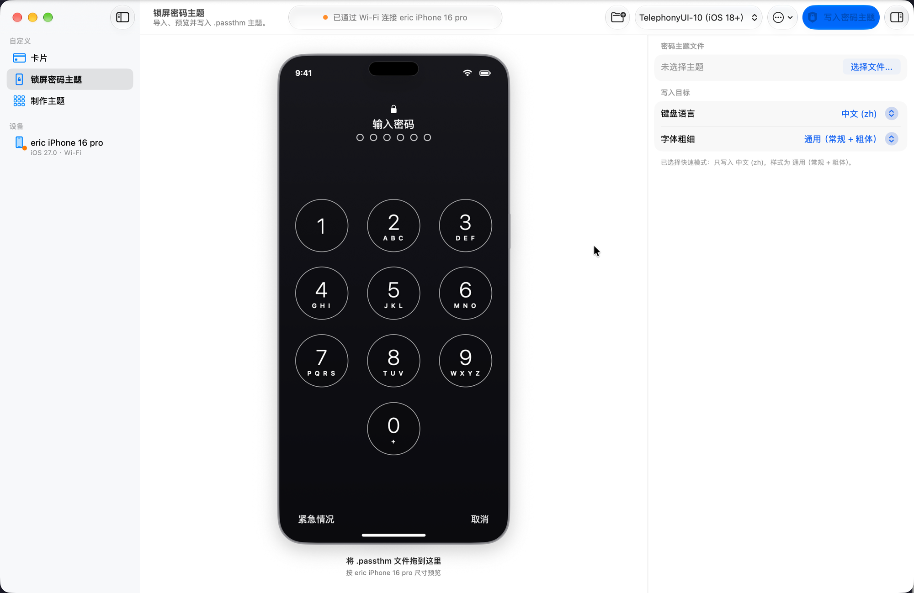
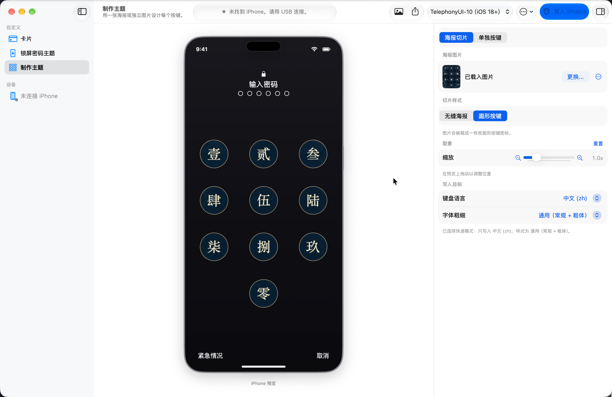

# FaceLift 🎴

> **适用于 iOS 18+ 的 Apple Wallet 卡面定制与锁屏密码主题工具(无需越狱)**  
> **v1.0.0** — 基于 `airlift` AirTraffic 同步漏洞实现。

**语言:** [English](README.md) | 简体中文

> [!IMPORTANT]
> **已测试环境:** 目前 v1.0.0 仅在 **macOS 27**(主机)驱动 **iPhone 16 Pro(iOS 27.0)** 的组合下完成真机测试。其他 macOS 或 iOS 版本应可正常使用,但尚未验证,欢迎反馈。

---

## 应用截图

| 钱包卡片 | 锁屏密码主题 | 制作主题 |
| :---: | :---: | :---: |
|  |  |  |

---

## v1.0.0 新增功能
- 🎨 **界面完全重构:** FaceLift 现为原生的三栏 macOS 应用——左侧为源列表侧边栏(钱包卡片 · 锁屏密码主题 · 制作主题,下方显示已连接的设备),中间为实时 iPhone 预览,右侧为随上下文变化的检查器。所有表面均采用干净的不透明材质,呈现沉稳、高对比的观感,在浅色与深色模式下都清晰易读。
- 🖼️ **从 iPhone 读回卡面:** 卡片已存储的卡面会被拉取到 Mac 预览中,并在多次启动间保留——已刷过的卡面不必重新设置。
- 🎯 **按需读取卡面:** 「读取选中卡面」只拉取勾选的卡片,卡片再多也不会拖慢速度。
- 🔌 **USB / Wi-Fi 连接识别:** 状态胶囊显示 iPhone 当前通过 USB(绿灯)还是 Wi-Fi 隧道(橙灯)连接,判定依据 usbmuxd 的权威传输信息。依赖 USB 的操作(如读取卡面)在 Wi-Fi 下会给出警告。
- 🌏 **简体中文界面:** 完整的 zh-Hans 本地化,并提供语言菜单(跟随系统 / English / 简体中文),同时新增荷兰语键盘写入目标。
- 🖱️ **全面支持拖放:** 可将 `.passthm` 拖到键盘预览上,或将图片拖到卡片或单个按键上。

## 功能特性
- 🎨 **自定义卡面:** 为 Apple Pay 和 Wallet 卡片设置自定义图案、纹理或银行标志。
- 🖥️ **原生 macOS 界面:** 重构后的侧边栏 + 预览 + 检查器布局,采用不透明、高对比的表面,完整支持浅色 / 深色模式。
- 🔢 **锁屏密码主题(.passthm):** 将流行 `.passthm` 主题中的自定义按键贴图直接应用到 iOS 18+ 锁屏。
- 🧩 **密码主题创作器:** 从单张壁纸自动生成(无缝海报切片),或逐键自定义构建主题。
- 🔍 **交互式照片取景:** 在按键内直接平移、缩放图片,并实时预览 iPhone 效果。
- ✏️ **编辑现有 .passthm 主题:** 在创作器中直接打开任意 Cowabunga 或 Nugget 主题包,调整按键贴图、重新取景,再导出或刷写。
- ⚡ **单卡与批量定制:** 为每张卡片设置独立图案,或一键将同一设计应用到全部卡片。
- 📱 **零门槛卡片检测:** 在 iPhone 的 Wallet 应用中点按任意卡片,即可实时检测其哈希。
- 🚀 **100% 独立运行(通用二进制):** 原生支持 **Apple Silicon** 与 **Intel (x86)** Mac。所有设备通信工具与图像引擎均已内置。
- 📦 **零前置依赖:** macOS 用户无需 Homebrew、Python 包或终端配置。

---

## 安装

### macOS(通用 DMG)
1. 从 [Releases](https://github.com/deluxebear/FaceLift/releases) 下载 **`FaceLift.dmg`**。
2. 打开 `FaceLift.dmg`,将 **`FaceLift.app`** 拖入**应用程序**文件夹。
3. 完全兼容 **Apple Silicon** 与 **Intel (x86)** Mac。

> [!NOTE]
> **macOS 首次启动(Gatekeeper):**
> 如果首次启动时 macOS 提示"无法验证开发者":
> - **方法一(界面操作):** 在应用程序中右键(或 Control+点击)`FaceLift.app` ➔ 点击**打开** ➔ 再点击**打开**。
> - **方法二(终端命令):**
>   ```sh
>   sudo xattr -cr /Applications/FaceLift.app
>   ```

---

## 如何自定义 Apple Wallet 卡面
1. 用 USB 数据线将 iPhone 连接到 Mac,确保已解锁并信任此电脑。
2. 在 FaceLift 侧边栏中选择**钱包卡片**,点击**扫描卡片**。
3. 在 iPhone 上:
   - **双击侧边(电源)按钮**打开 Apple Pay。
   - 通过 **Face ID** 验证。
   - **点按你的卡片**(或再点按一次)即可立即检测!
4. 点击任意卡片模型,或直接将图片拖放到卡片上。
5. 点击**写入卡面**。
6. 在 iPhone 的 App 切换器中强制关闭 **Wallet** 应用(或重启手机),即可看到新的自定义卡面!

---

## 如何应用锁屏密码主题(.passthm)
1. 在 FaceLift 侧边栏中选择**锁屏密码主题**。
2. 将任意 `.passthm` 文件拖到键盘预览上(或点击检查器中的**选择文件…**)。
3. FaceLift 会解析主题,并在数字键盘(0–9、*、#)上显示交互式预览。
4. 点击**应用密码主题**。
5. 锁定 iPhone 即可查看自定义密码按键。实测 iPhone 16 Pro（iOS 27.0）重启后会重新生成系统默认键盘，即使主题此前已成功显示。重启后如需继续使用，请重新写入；目前不保证主题跨重启保留。

> [!TIP]
> **全语言与粗体文本支持:**  
> FaceLift 会自动为所有系统语言(英语、乌克兰语、俄语、西班牙语、德语、法语等)扩展并刷写自定义按键资源,同时生成标准与**粗体文本**两套缓存位图(`--white` 与 `--white-bold`),无论你的 iOS 语言或辅助功能显示设置如何,主题都能正常生效!

---

## 从源码构建

```sh
git clone https://github.com/deluxebear/FaceLift.git
cd FaceLift
chmod +x build.sh
./build.sh
```
构建通用二进制(`arm64` + `x86_64`),将依赖打包进 `build/FaceLift.app`,并输出 `build/FaceLift.dmg`。

---

## 贡献者
- **[@deluxebear](https://github.com/deluxebear)**(FaceLift 开发者与维护者)

FaceLift 分叉自 **AirCard v1.2.3**,原作者:
- **[@mak5er](https://github.com/mak5er)**(AirCard 作者)— [GitHub](https://github.com/mak5er) · [Twitter / X](https://x.com/mak5er)
- **[@Lumid-Off](https://github.com/Lumid-Off)**(AirCard 贡献者与开发者)— [GitHub](https://github.com/Lumid-Off) · [Twitter / X](https://x.com/LumidOff)

- **[AirLift](https://github.com/0xjohnnydev/airlift)**,作者 **[0xjohnny (@0xjohnnydev)](https://github.com/0xjohnnydev)**:原始的 AirTraffic/ATAirlock 沙箱逃逸与概念验证,`AirliftFFI` 的基础。

## 致谢
- FaceLift 基于 **[AirCard v1.2.3](https://github.com/mak5er/AirCard)**,作者 **Johnny Franks (@Mak5er)**,遵循 MIT 协议授权。
- 核心漏洞利用基于 `airlift`(AirTraffic 同步逃逸)。
